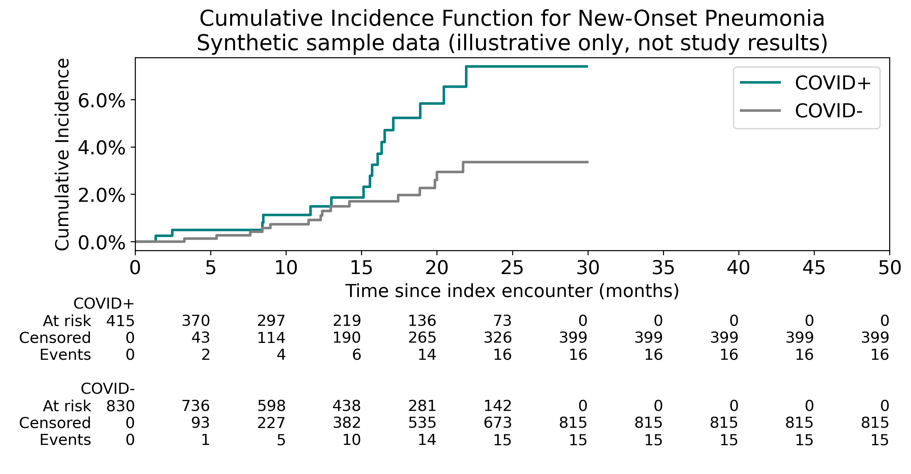
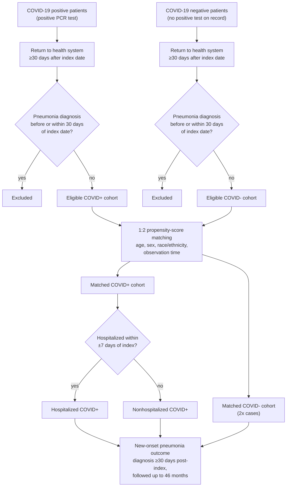

# pneumonia-covid-analysis-pipeline

Reproducible pipeline for the cohort selection, propensity matching, and survival
analysis behind:

> Duong KS, Henry SS, Duong TQ. **SARS-CoV-2 Infection and the Long-Term Risk of
> Pneumonia in an Urban Population: An Observational Cohort Study up to 46 Months
> After Infection.** *Clinical Infectious Diseases* 2025;81(6):1041–9.
> https://doi.org/10.1093/cid/ciaf345

## What this is

A retrospective cohort study using OMOP-formatted EHR data from the Montefiore
Health System (Bronx, NY) to test whether COVID-19 infection increases the
long-term risk of new-onset pneumonia, using propensity-matched controls and
Cox proportional hazards models. K.S.D. performed the cohort construction,
matching, survival analysis, and Cox modeling reported in the paper.



*Output of stage 3 run on the **synthetic** sample data. It shows what the
pipeline produces, not the study's results (see Published Results below).*

## Data availability

**No patient data is included in this repository.** The underlying dataset is
deidentified clinical data from the Montefiore Health System, used under an
IRB exemption (Einstein–Montefiore IRB #2021-13658) and institutional data use
terms that do not permit public redistribution.

`data/sample/` contains generated **synthetic** data: values from
independent random distributions calibrated to the paper's Table 1
rates so the pipeline can be run end-to-end and reviewed; results
produced from it are illustrative only and won't match the published numbers.
See `src/generate_synthetic_data.py`.

## Pipeline

Stages mirror the patient-selection flow in the paper's Figure 1: cohort
identification → return filter → prior-pneumonia exclusion → 1:2 propensity
matching → survival/hazard analysis.

| Stage | Script | What it does | Reads | Writes |
|---|---|---|---|---|
| — | `sql/*.sql` | OMOP queries: cohort identification, outcome definition, comorbidities/demographics | OMOP CDM tables | raw extracts |
| 1 | `src/01_cohort_selection.py` | New-onset pneumonia determination, demographics, comorbidities, hospitalization stratification (COVID+ only) | `data/sample/omop_extracts/` | `cohort_positive.csv`, `cohort_negative.csv` |
| 2 | `src/02_propensity_matching.py` | 1:2 propensity-score matching on age, sex, race/ethnicity, observation time; controls must fall within a caliper of 0.15 × SD of the propensity score | `cohort_positive.csv`, `cohort_negative.csv` | `matched_cohort_1to2.csv` |
| 3 | `src/03_survival_analysis.py` | Builds the analytic table; Kaplan-Meier cumulative incidence, with administrative censoring at 46 months (events after 46 months are censored, not counted) | `matched_cohort_1to2.csv` | `matched_binary_data.csv`, `figures/cumulative_incidence.png` |
| 4 | `src/04_cox_models.py` | Univariate + multivariate Cox proportional hazards models | `matched_binary_data.csv` | `cox_univariate.csv`, `cox_multivariate.csv` |

**Note on pipeline order vs. the original notebooks:** in the original
exploratory work, new-onset/hospitalization status was computed twice (once
pre-matching to build the eligible pool and again post-matching). Since
neither feeds the matching features, this pipeline computes it once,
pre-match (stage 1), which is equivalent and avoids the redundant pass.

## Cohort selection flow



Run in order:

```bash
pip install -r requirements.txt

# (re)build the synthetic sample data
python src/generate_synthetic_data.py

cd src
python 01_cohort_selection.py --data-dir ../data/sample/omop_extracts --out-dir ../results/cohort_selection
cp ../results/cohort_selection/cohort_positive.csv ../results/cohort_selection/cohort_negative.csv ../data/sample/
python 02_propensity_matching.py --data-dir ../data/sample --out-dir ../results/matching --ratio 1:2
python 03_survival_analysis.py --input ../results/matching/matched_cohort_1to2.csv --out-dir ../results \
    --subtitle "Synthetic sample data (illustrative only, not study results)"
python 04_cox_models.py --input ../results/matched_binary_data.csv --out-dir ../results
```

This has been run end-to-end on the synthetic sample data and produces a
complete set of outputs (cohort tables, matched cohort, survival curve, Cox
model summaries) — see `tests/test_pipeline.py` for unit tests.

```bash
pytest tests/
```

## Changes from the original analysis code

- **Caliper enforcement (stage 2).** The original code passed the caliper to
  scikit-learn's `NearestNeighbors` as `radius=`, which `kneighbors()` ignores,
  so no match was ever rejected for distance. The caliper is now checked
  explicitly on the propensity score (`_within_caliper()`), which leaves some
  cases unmatched.
- **46-month cutoff (stage 3).** Durations were clipped at 46 months, but
  events after 46 months were still counted as events. They are now censored
  at the cutoff.
- Both fixes have unit tests in `tests/test_pipeline.py`. The published
  results came from the original code, and the real data is not available
  to re-run them.

## Published Results (not reproducible from the synthetic sample)

- Hospitalized COVID-19 patients: aHR 3.67 (95% CI 3.27–4.15) for new-onset pneumonia vs. controls
- Nonhospitalized COVID-19 patients: aHR 1.40 (95% CI 1.26–1.55) vs. controls
- Full results in the published Tables 2–3

## Limitations

- The synthetic sample data is for pipeline demonstration only — it reproduces
  the schema and directional prevalence differences from the paper (e.g.
  higher comorbidity burden in the COVID+ arm), not the real cohort, and
  should not be used to draw any clinical conclusion. At this sample size,
  some Cox model terms will show expected convergence warnings.
- See the paper's own Limitations section for the study's methodological
  caveats.

## Citation

If referencing this work, please cite the published paper above.
